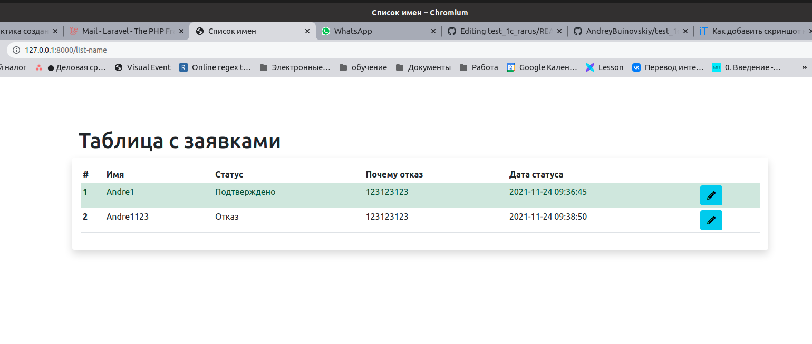

1) Сделал как написано в тз есть форма для ввода имени которое попадает в бд.
   
2) есть таблица в которой выводятся все имена запрашиваемые клиентами.
   
3) так же форма для редактирования записи в таблице(простановка статуса и написание причины отказа)
   
4) после сохранения формы редактирования в бд ставится время сохранения(время изменения статуса) и должен отправляться емейл, но я не успел настроить.
5) еще бы я бы сделал перед вводом имени регестрировать человека чтоб заявку по имени можно было привязывать к человеку и иметь его емейл ну и дописал бы условия редактирования заявок.

